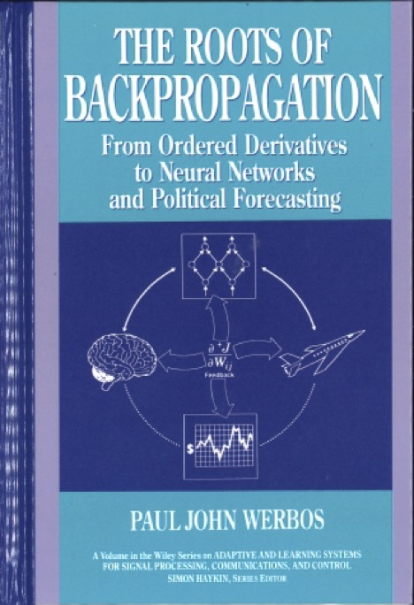

# The Roots of Backpropagation: From Ordered Derivatives to Neural Networks and Political Forecasting
## Paul John Werbos, 1994



```
@book{werbos1994roots,
  title={The roots of backpropagation: from ordered derivatives to neural networks and political forecasting},
  author={Werbos, Paul John},
  volume={1},
  year={1994},
  publisher={John Wiley \& Sons}
}
```